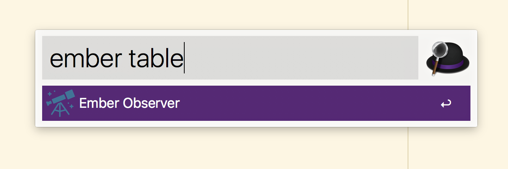

# alfred-ember-oberserver

> [Alfred 3](https://www.alfredapp.com) workflow to find relevant ember-cli addons

## Install

Download `.alfredworkflow` [in releases](https://github.com/flexbox/alfred-ember-observer/releases)

*Requires the Alfred [Powerpack](https://www.alfredapp.com/powerpack/).*

## Usage

In Alfred, type `ember`, <kbd>Enter</kbd>, and some text, to find relevant addons.

## License

MIT © [David Leuliette](https://davidl.fr)
